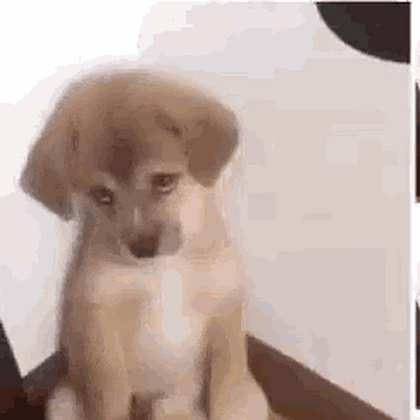

<h1 align="center">
     
</h1>

# (☞ﾟヮﾟ)☞ Índice:
---
- [Sobre](#-Sobre:)
- [Tecnologias utilizadas](#-Tecnologias-utilizadas:)
- [Como baixar o projeto](#-Como-baixar-o-projeto:)
- [Fotos e gifs de cachorrinhos](#-Fotos-e-gifs-de-cachorrinhos:)

# (☞ﾟヮﾟ)☞ Sobre:
---
O projeto **"Cachorro Pão"** foi criado para ser entregue durante as 3 semanas seguidas do processo de **capacitação da byron.solutions**. Tais entregas eram feitas semanalmente para por em prática tudo o que foi aprendido sobre **Git e GitHub** durante a semana.

Como a ideia do projeto era apenas atestar que o participante fez a capacitação e aprendeu algo com a mesma, eu resolvi dar um pouco da **minha personalidade** ao mesmo, adicionando fotos, gifs e textos engraçadinhos.

# (☞ﾟヮﾟ)☞ Tecnologias utilizadas:
---
O projeto é algo simples, não com foco na estético ou no código, mas sim na utilização do GitBash e outras ferramentas relacionadas (GitKraken, GitLab, GitHub, GitHub Fot Desktop, etc). Para não me distrair e perder o foco no aprendizado de Git e GitHub, optei por construir uma página absolutamente simples com HTML, e trabalhar sobre ela.

# (☞ﾟヮﾟ)☞ Como baixar:
---
```bash
    # Clonar o repositório

    $ git clone https://github.com/CaiqueBrandani/Capacitacao-git-github <nome que você vai dar a pasta do projeto>
```

# (☞ﾟヮﾟ)☞ Fotos e gifs de cachorrinhos:
---

<h1 align="center">
     
</h1>

<h1 align="center">
     
</h1>

<h1 align="center">
     
</h1>

<h1 align="center">
     
</h1>

<h3>
    Desenvolvido por um amante de doguinhos chamado Braique Crandani 🐱‍👤
</h3>